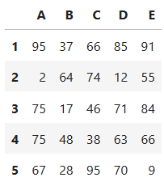

### Ungarischer Algorithmus

[Erläuterung](https://youtu.be/7fF-IYGBins) - [Beispiel](https://youtu.be/MggcqYMX2KI)

Bestimme nach dem Verfahren aus dem Unterricht das optimale Matching.

**A1**

 

---- 

**Lösungen**

A1: 

   optimale Kosten: 151, 
   optimale Zuordnung:  D A B C E
   
   