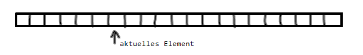
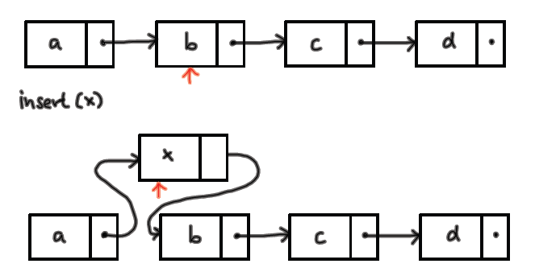
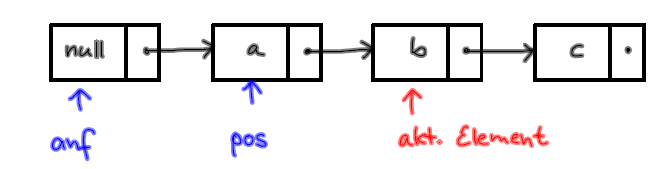

## ADT - Liste

#### Abstrakte Datentypen

Abstrakter Datentyp (ADT) = Datenstruktur + (abstrakte) Operationen.

Abstrakt = nicht implementiert, nur Vorgaben.  

Die Datenstrukturen werden unabhängig von ihrer späteren Implementierung in einer Programmiersprache beschrieben.

ADTs bilden eine Spezifikation der Schnittstelle nach außen, indem sie Operationen und ihre Funktionalität festlegen.


#### ADT Liste

Eine *Liste* ist eine (ggf. leere) Folge von Elementen zusammen mit einem so genannten 
(ggf. undefinierten) *aktuellen Element*. 



#### Schnittstelle der ADT Liste

```
 empty   :  liefert true, falls Liste leer     
 endpos  :  liefert true, wenn Liste abgearbeitet   
 reset   :  das erste Listenelement wird zum aktuellen Element   
 advance :  der Nachfolger des akt. wird akt. Element  
 elem    :  liefert das aktuelle Element  
 insert  :  fügt vor das aktuelle Element ein Element ein, das neue wird zum aktuellen Element 
 delete  :  löscht das aktuelle Element, der Nachfolger wird zum aktuellen Element.
```

#### Umsetzung der Schnittstelle in eine Klasse.
Die Methoden sind noch nicht implementiert.

```python
class Liste:
    '''  Eine Liste ist eine (ggf. leere) Folge von Elementen zusammen mit einem
    (ggf. undefinierten) aktuellen Element  '''
    
    def empty(self):
        ''' liefert true, falls Liste leer '''
        pass
        
    def endpos(self):
        ''' liefert true, wenn die Liste abgearbeitet ist '''
        pass

    def reset(self):
        ''' das erste Listenelement wird aktuelles Element '''
        pass
    
    def advance(self):
        '''  der Nachfolger des aktuellen Elements wird aktuelles Element '''
        pass

    def elem(self):
        ''' liefert das aktuelle Element '''
        pass
  
    def insert(self, x):
        ''' Fügt x vor dem aktuellen Element ein, x wird zum neuen aktuellen Element. '''
        pass

    def delete(self):
        ''' löscht das aktuelle Element. Der Nachfolger wird neues aktuelles Element. '''
        pass
```

#### Genauere Spezifikation des Verhaltens der Liste

Mit `assert` Anweisungen können wir unsere Vorgaben präzisieren und unsere Implementation überprüfen.

```python
li = Liste()
assert li.empty()
assert li.endpos()
# Fehler bei li.elem(), li.advance(), li.delete()
li.insert('A')
assert not li.empty()
assert not li.endpos()
assert li.elem() == 'A'
li.advance()
assert li.endpos()
# Fehler bei li.elem(), li.advance(), li.delete()
li.insert('B')
assert not li.endpos()
li.advance()
li.insert('C')
li.reset()
assert li.elem() == 'A'
li.advance()
li.delete()
assert li.elem() == 'C'
li.delete()
assert li.endpos()
li.reset()
li.delete()
assert li.empty()
```
**Beachte**: 
Bei einer nicht-leeren Liste können wir, wenn das aktuelle Element das letzte Element der Liste ist, mit
`advance` noch einen Schritt vorangehen. Danach ist `endpos` True, das aktuelle Element ist dann
undefiniert und `elem`, `advance`, und `delete` erzeugen einen Fehler.


#### Die typische Schleife

Die Funktionalität von `endpos` ist so gewählt, dass wir mit der folgenden Schleife durch alle
Elemente der Liste gehen:

```
a = Liste()
...            # füge Sachen in die Liste ein
a.reset()
while not a.endpos():
    x = a.elem()
    print(x)   # oder machwas mit x
    a.advance()
```


<details><summary><strong>Implementation mittels Python-List</strong></summary>
 

```python
class Liste:

    def __init__(self):
        self.a = []
        self.akt = -1     # Index des aktuelles Element

    def empty(self):
        return len(self.a) == 0

    def endpos(self):
        return self.empty() or self.akt == len(self.a)

    def advance(self):
        if self.endpos(): raise RuntimeError("Fehler in advance: Am Ende der Liste")
        self.akt += 1

    def elem(self):
        if self.endpos(): raise RuntimeError("Fehler in elem: Am Ende der Liste")
        return self.a[self.akt]

    def insert(self, x):
        if self.empty():
            self.akt = 0
        self.a.insert(self.akt,x)

    def delete(self):
        if self.endpos(): raise RuntimeError("Fehler in delete: Am Ende der Liste")
        del self.a[self.akt]
        if self.empty(): self.akt = -1

    def reset(self):
        if not self.empty(): self.akt = 0

```

Die Implementation hat den Nachteil, dass die Methoden `insert` und `delete` im worst case eine Laufzeit `O(n)` haben.


 
</details>


#### Implementationsidee: Verkettete Einträge


<details><summary>Die Klasse Eintrag</summary>
<p>

```python
class Eintrag:  
    def __init__(self):
        self.inhalt = None
        self.next = None
```
</p>
</details>


#### Einfügen eines Elements

Die Situation bei der Implementation von `insert`:



<details><summary>Welches Problem entsteht?</summary>
<p>

Wie kann man den Zeiger, der auf das aktuelle Element zeigt, auf x umbiegen?
</p>
</details>

#### Lösung für das insert-Problem



`pos` zeigt auf den Listen-Eintrag vor dem aktuellen Element.   

`anf` zeigt auf einen Dummy-Eintrag vor dem ersten Element.


<details><summary><strong>Implementation durch verkettete Einträge</strong></summary>
<p>

```python
class Liste:
    def __init__(self):   
        self.anf = Eintrag()
        self.pos = self.anf
       
    def empty(self):   
        return self.anf.next is None
    
    def endpos(self):  
        return self.pos.next is None

    def reset(self): 
        self.pos = self.anf

    def advance(self):  
        if self.endpos(): raise RuntimeError("Fehler: Liste am Ende")
        self.pos = self.pos.next

    def elem(self):  
        if self.endpos(): raise RuntimeError("Fehler: Liste am Ende")
        return self.pos.next.inhalt

    def insert(self, x):  
        hilf = Eintrag()
        hilf.inhalt = x
        hilf.next = self.pos.next
        self.pos.next = hilf

    def delete(self):  
        if self.endpos(): raise RuntimeError("Fehler: Liste am Ende")
        self.pos.next = self.pos.next.next
```
</p>
</details>`