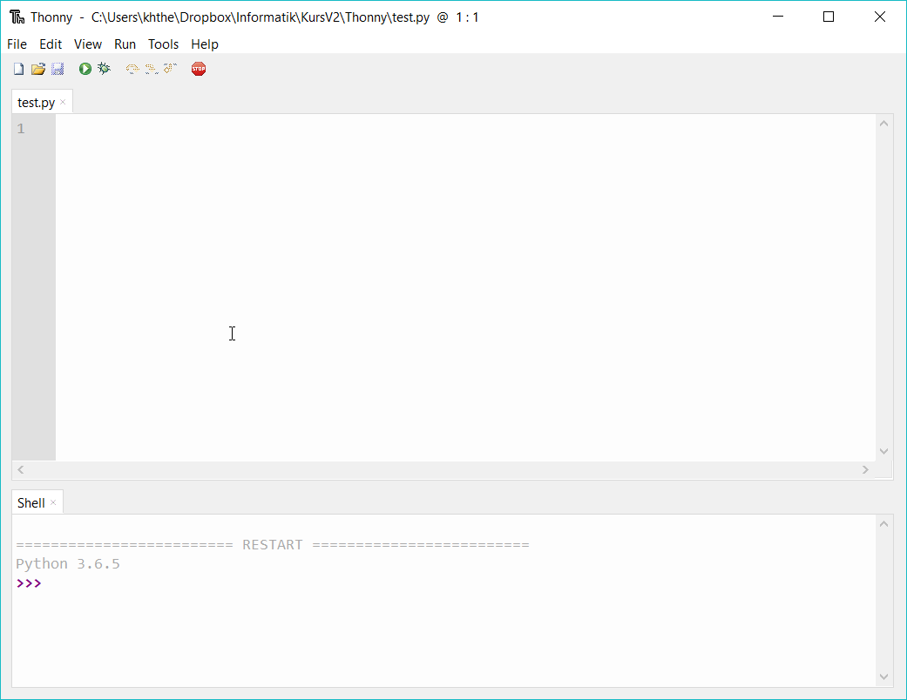

#### Thonny

 
Eine Entwicklungsumgebung (IDE = integrated development environment) ist ein Programm, das beim Erstellen, Ausführen und Testen von
Programmen hilft. Thonny ist eine Python IDE für Programmieranfänger.  

Installiere __[Thonny]("https://thonny.org/")__ . Durch die Installation wird eine Version von Python 3 mit installiert.
Thonny öffnet sich mit einem Fenster für Programmcode und einer shell.

  <a href="https://www.youtube.com/playlist?list=PLWeMgMhRDsIEtLAYCjoljOfKx2RnFOqcV">Videos</a>
