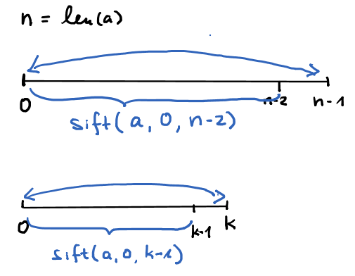

## Große Überschrift mit 2 Hash
Text direkt drunter

#### Kleinere Überschrift mit 4 Hash
Text direkt drunter

Text inline Code `Strg M, Strg I`

```
Text als Code Block
mit Strg M, Strg C

``` 

#### Link

Link [doc](https://github.com/adam-p/markdown-here/wiki/Markdown-Cheatsheet)
  mit `[doc](https://github.com/adam-p/markdown-here/wiki/Markdown-Cheatsheet)`

#### Bilder

Mit 
``  kann die Größe leider nicht kontrolliert werden.

Daher ``



 


